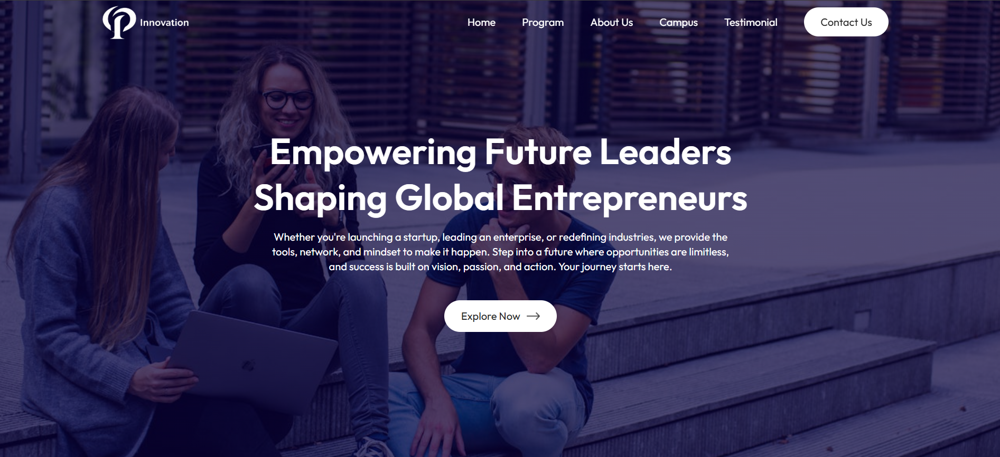

# 🎓 Innovation University- Single Page Application (SPA)

Welcome to the official Single Page Application (SPA) for **Innovation University** – a forward-thinking academic institution focused on creativity, technology, and excellence.

This modern web application was built using **React (with Vite)** for lightning-fast performance and **CSS** for clean, responsive styling.

## 🧩 Features

- **Hero Section** – Bold introduction with mission callout and a CTA button.
- **Programs** – Browse academic offerings with details for each course.
- **About** – Learn about Innovation University’s vision, values, and culture.
- **Campus** – A glimpse into campus life and infrastructure.
- **Testimonials** – Hear from our (imaginary) students about their experiences.
- **Contact Us** – Simple contact form with validation to connect with the university.
## 🛠 Tech Stack

| Technology | Purpose                     |
|------------|-----------------------------|
| React      | Core framework              |
| React Router | Navigation between sections |
| CSS / Media Query | Styling & responsiveness  |
| Form Handling | Basic form validation (Contact Us) |

## Screenshots

Here are a few snapshots of the application in action:

### 🏠 Hero Section



## 📦 Installation & Setup

Follow these steps to run the project locally:

1. **Clone the repository**

   ```bash
   git clone https://github.com/Sonuku4564/Innovation_University.git
   ```

2. **Navigate to the project directory**

   ```bash
   cd innovation-university
   ```

3. **Install the dependencies**

   ```bash
   npm install
   ```

4. **Start the development server**

   ```bash
   npm start
   ```

The app will now be running at: [http://localhost:5173](http://localhost:5173)

---


## Contributing

Contributions, issues, and feature requests are welcome! You can open a pull request, and we’ll review it for merging into the main repo.


## License

This project is open source and available under the MIT License.


